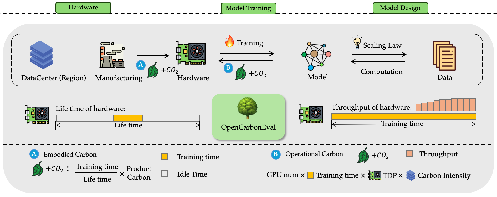
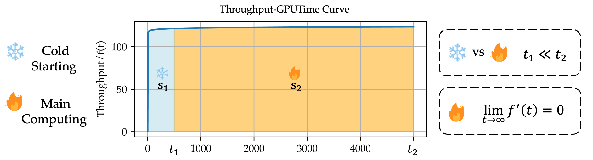
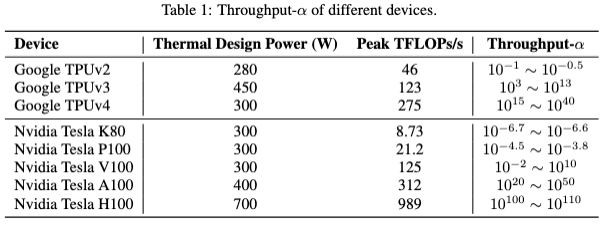

<h1 align="center">

 
OpenCarbonEval: A Unified Carbon Emission Estimating Framework
</h1>

  <a href="https://github.com/answers111/OpenCarbonEval"><b>[📜 Paper]</b></a> •
  <a href="https://github.com/answers111/OpenCarbonEval"><b>[🐱 GitHub]</b></a> 

## 🔥 News

- [2024/05/22] OpenCarbonEval paper, repo, and website released.

## 💡 Introduction
OpenCarbonEval is a unified framework for integrating large-scale models across diverse modalities to predict carbon emissions.
### Overview

    
     
    <em>Figure 1: The overview pipeline of OpenCarbonEval.</em>

### Dynamic Throughput Modeling
In OpenCarbonEval, we propose a dynamic throughput modeling approach that could capture workload and hardware fluctuations in the training process for more precise emissions estimates.

    
     
    <em>Figure 2: Dynamic throghput modeling in OpenCarbonEval.</em>

### Throughput-α of different devices

    
     
    <em>Figure 3: Throughput-α of different devices.</em>

## 📖 Leaderboard

| Model             | Publication Date | Task         | Carbon Emission (tCO2eq) |
|--------------------|------------------|-------------------|-------------|
| Gemini Ultra       | 2023-12-06       | Language model    | 18874.84    |
| GPT-4              | 2023-03-15       | Language model    | 10072.85    |
| MegaScale (Production) | 2024-02-23     | Language model    | 6994.67     |
| Falcon-180B        | 2023-09-06       | Language model    | 3023.29     |
| Inflection-2       | 2023-11-22       | Language model    | 3008.24     |
| Inflection-2.5     | 2024-03-07       | Chat              | 3005.55     |
| PaLM 2             | 2023-05-10       | Language model    | 2652.28     |
| Llama 3-70B        | 2024-04-18       | Chat              | 1896.61     |
| GPT-3.5 (text-davinci-003) | 2022-11-28 | Language model    | 1264.95     |
| Minerva (540B)     | 2022-06-29       | Quantitative reasoning | 1001.12     |
| PaLM (540B)        | 2022-04-04       | Language model    | 984.65      |
| U-PaLM (540B)      | 2022-10-20       | Language model    | 924.68      |
| Flan-PaLM 540B     | 2022-10-20       | Language model    | 913.84      |
| GPT-3 175B (davinci) | 2020-05-28     | Text autocompletion | 562.70      |
| Megatron-Turing NLG 530B | 2021-10-11 | Language model    | 444.94      |
| xTrimoPGLM -100B  | 2023-07-06       | Proteins          | 425.01      |
| Llama 2-70B        | 2023-07-18       | Language model    | 308.99      |
| LaMDA              | 2022-02-10       | Language model    | 265.93      |
| Gopher (280B)      | 2021-12-08       | Language model    | 243.48      |
| BLOOM-176B         | 2022-11-08       | Language model    | 235.32      |
| LLaMA-65B          | 2023-02-24       | Language model    | 232.19      |
| PanGu-Σ            | 2023-03-20       | Code generation   | 221.32      |
| Falcon-40B         | 2023-03-15       | Language model    | 168.03      |
| OPT-175B           | 2022-05-02       | Language model    | 164.92      |
| Parti              | 2022-06-22       | Text-to-image     | 157.54      |
| ViT-22B            | 2023-02-10       | Object detection  | 149.16      |
| Galactica          | 2022-11-16       | Language model    | 124.56      |
| BloombergGPT       | 2023-03-30       | Language model    | 100.43      |
| ESM2-15B           | 2022-07-21       | Proteins          | 89.06       |
| AlexaTM 20B        | 2022-08-02       | Language model    | 87.09       |
| Meena              | 2020-01-28       | Text autocompletion | 86.65       |
| Nemotron-3-8B      | 2023-11-15       | Chat              | 76.79       |
| Pangu-Weather      | 2023-07-05       | Weather prediction | 70.17       |
| Skywork-13B        | 2023-10-30       | Language model    | 69.91       |
| iGPT-XL            | 2020-06-17       | Image completion  | 66.76       |
| Switch             | 2021-01-11       | Text autocompletion | 64.16       |
| ByT5-XXL           | 2021-05-28       | Language model    | 63.25       |
| ProtT5-XXL         | 2021-05-04       | Proteins          | 59.96       |
| Flamingo           | 2022-04-29       | Visual question answering | 52.91       |
| WizardLM-7B        | 2023-04-24       | Language model    | 49.88       |
| FLAN 137B          | 2021-09-03       | Language model    | 41.35       |
| BlenderBot 3       | 2022-08-10       | Chat              | 40.00       |
| Meta Pseudo Labels | 2021-03-01       | Image classification | 37.98       |
| StarCoder          | 2023-05-09       | Code generation   | 35.07       |
| CoAtNet            | 2021-06-09       | Image classification | 33.97       |
| Turing-NLG         | 2020-02-13       | Text autocompletion | 33.17       |
| Llama 2-7B         | 2023-07-18       | Language model    | 32.67       |
| ProtBERT-BFD       | 2021-05-04       | Proteins          | 32.32       |
| GOAT               | 2021-07-27       | Open ended play   | 31.90       |
| Taiyi-Stable Diffusion | 2022-10-31 | Image generation  | 31.28       |
| ProtT5-XXL-BFD     | 2021-05-04       | Proteins          | 30.71       |
| CoCa               | 2022-06-14       | Image classification | 27.74       |
| T5-11B             | 2019-10-23       | Text autocompletion | 26.45       |
| AlphaStar          | 2019-10-30       | StarCraft         | 24.43       |
| ALIGN              | 2021-06-11       | Representation learning | 22.36       |
| Stable Diffusion (LDM-KL-8-G) | 2022-04-13 | Image generation  | 21.59       |
| XGLM-7.5B          | 2021-12-20       | Translation       | 18.80       |
| LLaMA-7B                  | 2023-02-24   | Language model    | 17.40                 |
| BASIC-L                   | 2021-11-19   | Image classification | 15.76                 |
| T0-XXL                    | 2021-10-15   | Language model    | 15.59                 |
| CLIP (ViT L/14@336px)    | 2021-01-05   | Zero-shot image classification | 13.76                 |
| Flan-T5 11B               | 2022-10-20   | Language model    | 12.65                 |
| ProGen2-xlarge            | 2022-06-27   | Proteins          | 11.12                 |
| GShard (dense)            | 2020-06-30   | Translation       | 10.56                 |
| NLLB                      | 2022-07-06   | Translation       | 6.90                  |
| Imagen                    | 2022-05-23   | Text-to-image     | 5.65                  |
| OmegaPLM                  | 2022-07-22   | Proteins          | 5.45    |
## ✨ Star History

